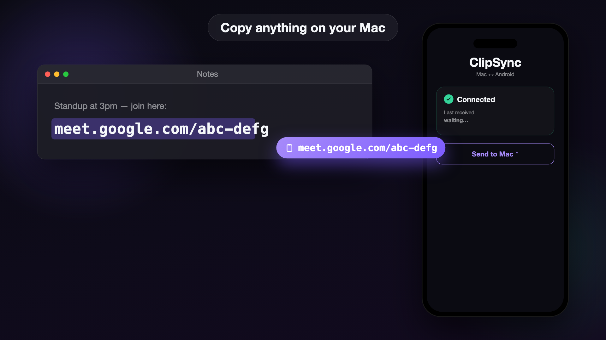

<div align="center">

# ClipSync

**Copy on your Mac, paste on your Android phone — and back.**
Like Apple's Universal Clipboard, but for Mac ↔ Android over your local Wi-Fi — no cloud, no account, no cable.

[](https://github.com/sandeep-khr/Mac-Android-Clipboard-Sync/actions/workflows/ci.yml)
[](https://github.com/sandeep-khr/Mac-Android-Clipboard-Sync/releases/latest)
[](https://github.com/sandeep-khr/Mac-Android-Clipboard-Sync/releases/latest)
[](LICENSE)


### [⬇ Download the latest release](https://github.com/sandeep-khr/Mac-Android-Clipboard-Sync/releases/latest)



</div>

Built this because I got tired of sending WhatsApp/emailing myself snippets
between a Mac and an Android phone. Android makes clipboard sync annoying (it blocks
background apps from reading the clipboard), so this is my attempt to get as
close to "it just works" as the platform allows.

## What works today

- **Mac → Android**: fully automatic. Copy on the Mac, it shows up on the
  phone's clipboard within a second, background app or not.
- **Android → Mac**: one tap. Either the "Send to Mac" quick-settings tile, or
  Share → ClipSync from any app. (Android won't let a background app read the
  clipboard automatically without root-level tricks that don't survive most
  OEM skins — ColorOS in particular blocks it outright. Happy to hear if
  anyone finds a way around this.)
- Encrypted end-to-end (X25519 + AES-256-GCM), reconnects automatically after
  Wi-Fi drops or sleep/wake, survives phone reboots.

## Install

Grab the latest build from the [**Releases**](../../releases) page:

- **Android** — download `ClipSync-android.apk`, open it on your phone, allow
  "install unknown apps" if prompted. Open it once and it auto-connects.
- **Mac** — download `ClipSync-mac.zip`, unzip, drag `ClipSync.app` to
  Applications. It's ad-hoc signed (not notarized — I don't have a paid Apple
  Developer account), so macOS blocks it on first open. Clear the quarantine flag
  once, then open it:
  ```
  xattr -dr com.apple.quarantine /Applications/ClipSync.app
  ```
  A clipboard icon appears in the menu bar — turn on **Launch at Login** from it.

Both devices must be on the **same Wi-Fi**.

## Build from source

1. Build and run the Mac app (`mac/ClipSyncCore` — `swift run clipsync-menubar`,
   or use `mac/build-app.sh` to get a proper `.app` you can add to Login Items).
2. Install the Android app (`android/ClipSyncAndroid`) on your phone, same
   Wi-Fi network. Open it once, allow the two permission prompts (notifications
   + battery), and that's it — no "Connect" button, no pairing dance.
3. Optional: tap "Add Send to Mac quick tile" in the app for one-tap
   phone → Mac pushes.

## Repo layout

- `mac/ClipSyncCore` — Swift package: the menu bar app + the core sync logic
  (watcher, crypto, WebSocket server), plus a CLI for local testing.
- `android/ClipSyncAndroid` — the Kotlin/Android app.
- `docs/` — protocol spec, pairing flow, and the build/roadmap notes.

## Known limitations / what's next

There's no trust prompt yet — any device on your LAN that speaks the protocol
can connect. Fine for a home network, not something I'd run on a coffee shop
Wi-Fi. See the open issues for that and a couple of other things I haven't
gotten to (persistent device keys, image/rich clipboard support).

Text only for now, Wi-Fi only (no cellular relay), and it's a personal project
— use at your own risk.
